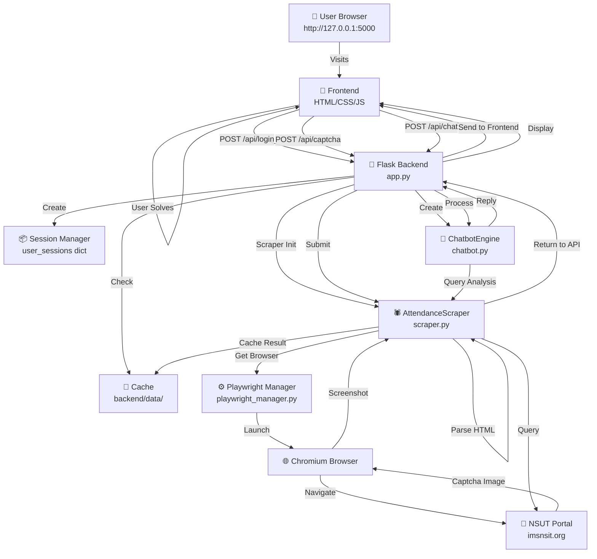
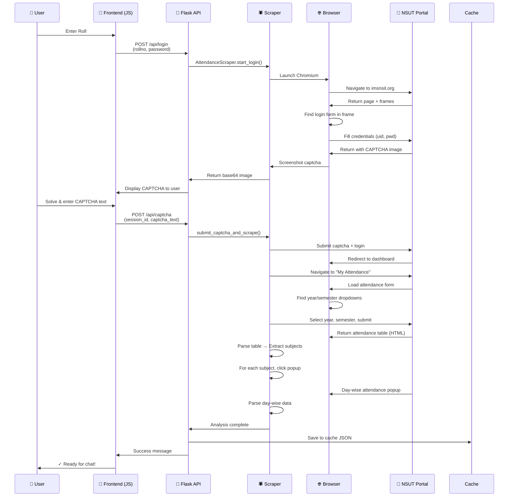
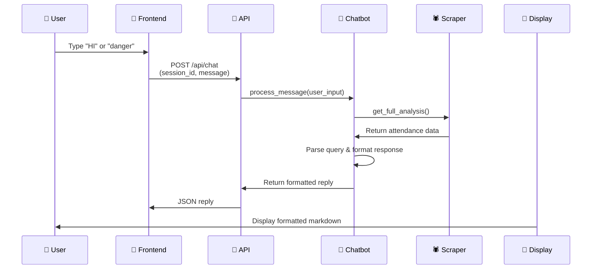
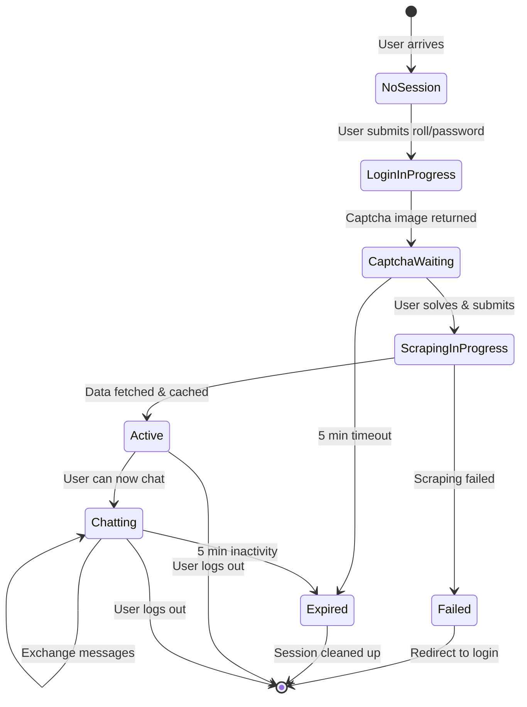
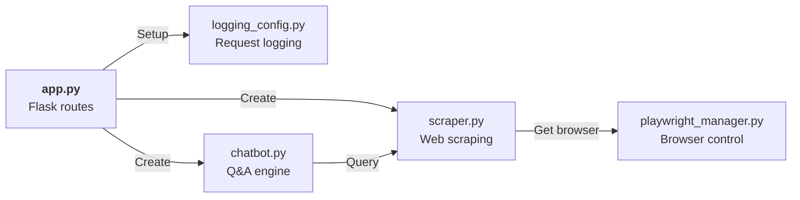
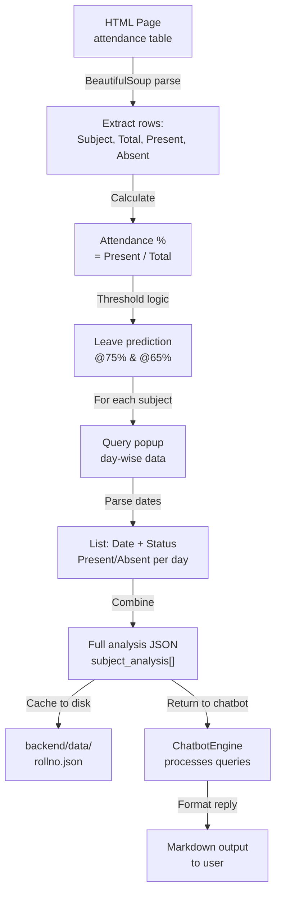
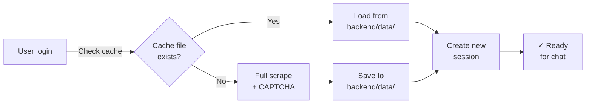
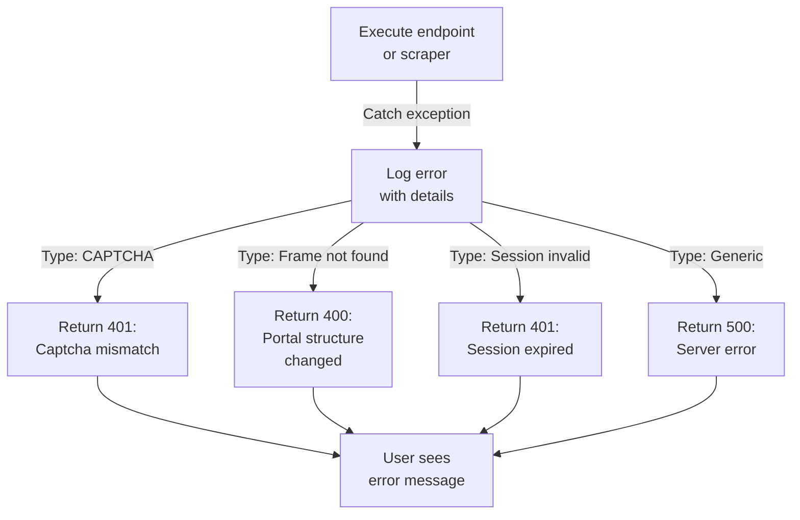

# Architecture & Data Flow Diagrams

## Complete System Architecture

## Request Flow: Login with Captcha

## Request Flow: Chat Query

## Session Lifecycle

## Module Dependencies

## Data Flow: Attendance Data Processing

## Caching Strategy

## Error Handling Flow

## Technology Stack

| Layer | Component | Technology |
|:---:|:---:|:---:|
| **Frontend** | UI/UX | HTML5, CSS3, Vanilla JavaScript |
| | Styling | Glassmorphism CSS |
| **Backend** | Framework | Flask 3.1.3 |
| | CORS | flask-cors 6.0.2 |
| **Scraping** | Automation | Playwright 1.59.0 (Chromium) |
| | HTML Parsing | BeautifulSoup4 4.14.3 |
| | Web Requests | requests 2.34.2 |
| **Utilities** | Logging | Python logging |
| | Configuration | Python dotenv (via .env) |
| **Deployment** | Server | Gunicorn (production) |
| | Platform | Render, Heroku, AWS, etc. |
