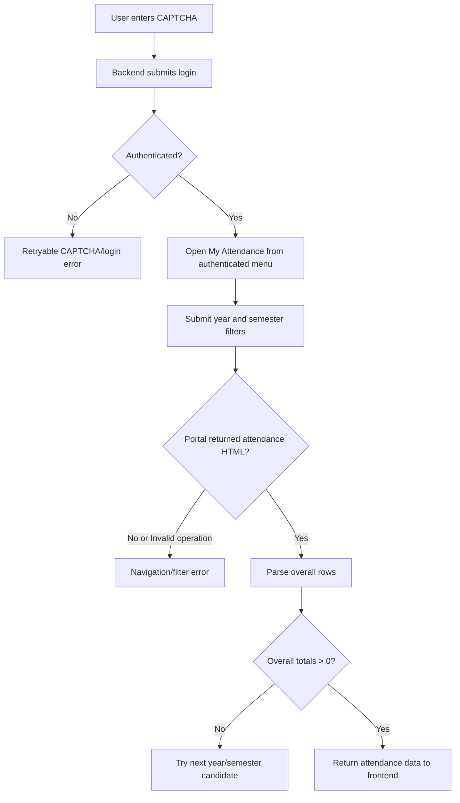
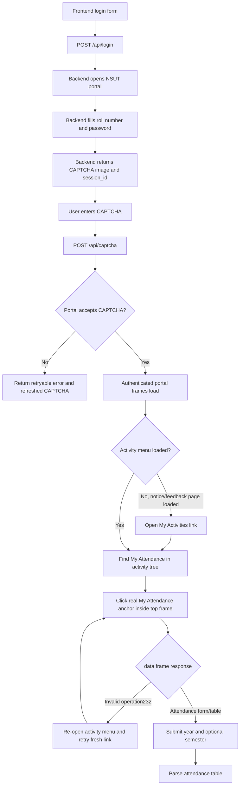
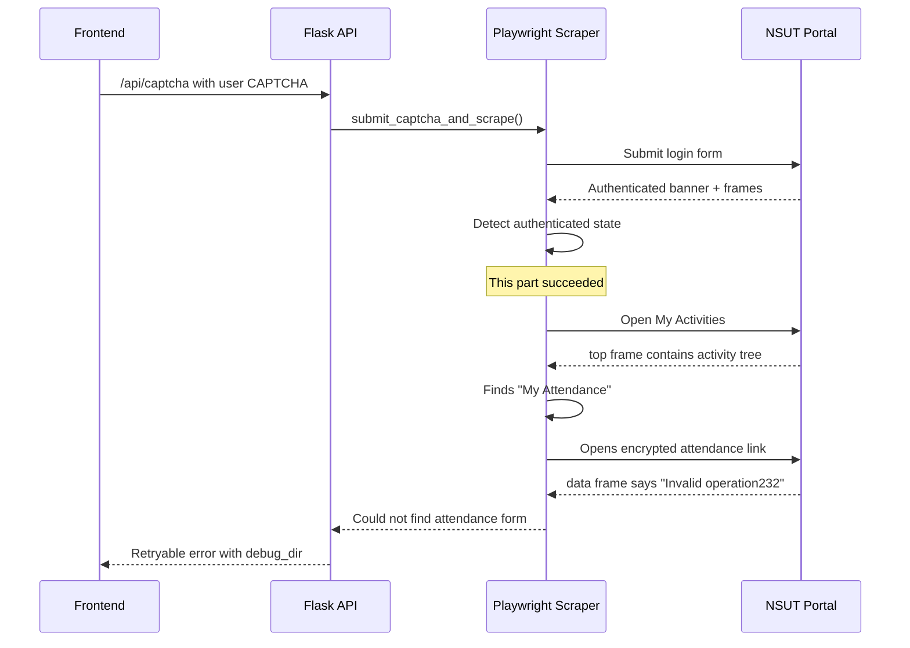
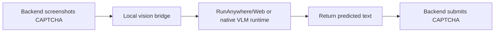

# CAPTCHA And Attendance Debug Notes

## Latest Finding: No Attendance Records Found

Latest reproduced session:

`backend/scrape/f08fbd08-f7ba-44a0-adf7-2540f09d3007`

This failure was not caused by an invalid student, a frontend bug, or a wrong CAPTCHA. The backend
logged in successfully, opened `My Attendance`, submitted the portal attendance filters, and the
portal returned real attendance rows. The error came from the backend parser: it was looking at the
first monthly table shape and did not understand the portal's final `Overall Class`,
`Overall Present`, and `Overall (%)` rows.

The fixed scraper now:

- prefers likely current semesters in descending order, for example `4, 3, 2, 1` for roll
  `2024UME4116` on 2026-05-16
- skips empty year/semester results where all overall totals are zero
- parses the final overall attendance rows across the full portal result
- maps subject codes like `MEMEC302` to subject names like `Manufacturing Processes-I`

Confirmed end-to-end response after the fix:

```json
{
  "success": true,
  "message": "✓ Login successful! Attendance data fetched.",
  "subjects": ["MEMEC302", "MEMEC303", "MEMEC304", "MEMEC305", "MEMTC301"]
}
```



## Current Finding

The latest failing session was:

`backend/scrape/36a3c5da-1b49-479c-a783-2dcce94e7d76`

This was not a frontend failure and not a CAPTCHA entry failure. The backend debug file
`05_login_outcome_attempt_1.json` shows:

```json
{
  "state": "authenticated",
  "detail": null
}
```

So the portal accepted the login. The failure happened after login, when the scraper tried to find
and open the `My Attendance` link.

The scraper did find the link:

```json
{
  "target": "data",
  "text": "My Attendance",
  "frame_name": "top"
}
```

The failure happened in the `data` frame immediately after trying to open that link:

```html
<html><head></head><body>Invalid operation232.</body></html>
```

That means the current problem is backend portal-frame navigation, not the login form and not the
frontend. The encrypted `plum_url.php` attendance link must be opened from the real portal menu
frame so the portal keeps the expected target/referrer/session context. Direct navigation to that
encrypted URL can produce `Invalid operation232`.

## Flow



## Where The Previous Error Came From



## Frontend Versus Backend

The frontend is only responsible for:

- collecting roll number/password
- showing the CAPTCHA image
- sending `session_id` and CAPTCHA text to `/api/captcha`
- showing backend errors

The failing session proves the frontend sent the CAPTCHA correctly because the backend reached
`state: authenticated`. The current error happens after the backend has the authenticated menu and
attempts to open the encrypted attendance link. That is a backend/portal-frame navigation issue,
not a frontend issue.

## Implemented Fix

The scraper now:

- clicks the real portal anchor from inside the source frame instead of using direct `goto` for
  encrypted `plum_url.php` links
- records `Invalid operation` details as JSON when the portal rejects a link
- retries by reopening `My Activities` and finding a fresh `My Attendance` link
- finds the attendance form without requiring a semester dropdown

The login UI no longer asks for semester. If the attendance page has a semester selector, the
backend auto-selects the first available option.

## RunAnywhere / Vision AI Note

RunAnywhere is useful for local/on-device AI, including Web SDK support and vision-language model
capability in supported platforms. For this Flask backend, the practical integration shape is a
local HTTP bridge:



The existing backend supports this style through:

- `CAPTCHA_SOLVER=runanywhere`
- `RUNANYWHERE_CAPTCHA_URL=http://127.0.0.1:<port>/solve`
- `RUNANYWHERE_API_KEY=<optional>`

Important: the current failure happened after a correct CAPTCHA was accepted, so vision AI would
not have fixed this specific `My Attendance` error. It can help reduce manual CAPTCHA typing, but
the portal menu navigation still needs the `My Activities` recovery path.

Reference: https://github.com/RunanywhereAI/runanywhere-sdks
