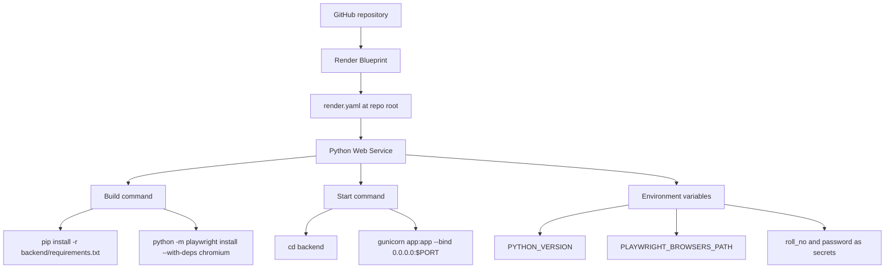
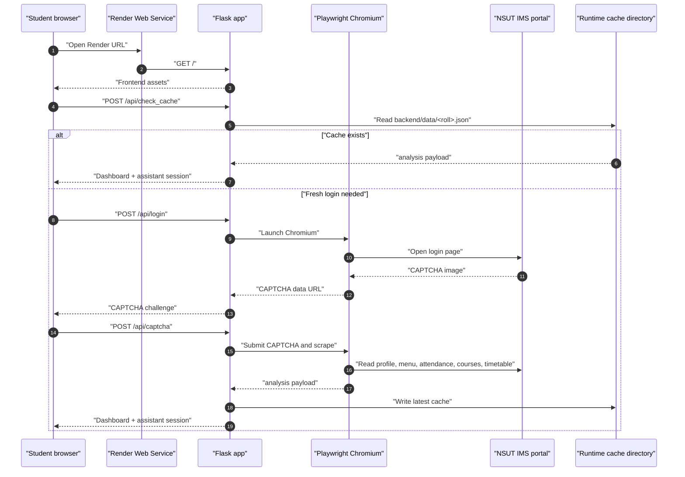
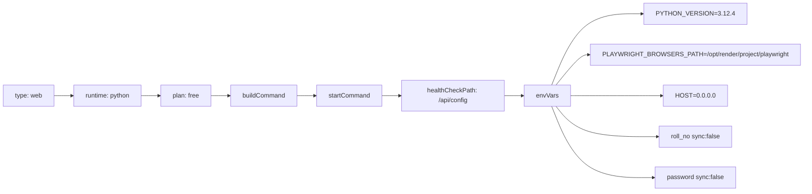
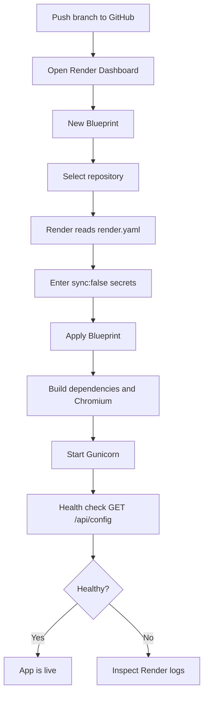
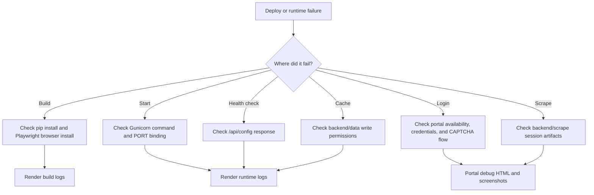

# Render Deployment Notes

This file explains how the Render deployment is wired and what happens when a new deploy starts.

## Blueprint Overview

## Request Flow On Render

## Current `render.yaml`

## Environment Variables

| Key | Required | Value | Notes |
|:---|:---:|:---|:---|
| `PYTHON_VERSION` | Yes | `3.12.4` | Pins Render Python runtime. |
| `PLAYWRIGHT_BROWSERS_PATH` | Yes | `/opt/render/project/playwright` | Keeps the Chromium browser install in a stable Render project path. |
| `HOST` | Yes | `0.0.0.0` | Lets Gunicorn expose the Flask app. |
| `PORT` | Provided by Render | Render value | Used by Gunicorn in the start command. |
| `roll_no` | Yes | secret | Portal roll number. Do not commit. |
| `password` | Yes | secret | Portal password. Do not commit. |
| `CAPTCHA_SOLVER` | Optional | `tesseract` or `runanywhere` | Manual CAPTCHA entry still works without it. |
| `RUNANYWHERE_CAPTCHA_URL` | Optional | endpoint URL | Used only when `CAPTCHA_SOLVER=runanywhere`. |
| `RUNANYWHERE_API_KEY` | Optional | secret | Bearer token for a compatible solver endpoint. |

## Deploy Steps

## Runtime Notes

- Render starts the web service with `gunicorn app:app` from the `backend/` directory.
- Flask serves both the API and the static frontend.
- The app uses Render's `PORT` environment variable in the Gunicorn bind address.
- Local cache files created on Render are runtime data. They should not be committed to git.
- Free instances may sleep when inactive, so the first request after idle can be slower.
- If runtime logs show `Playwright browser failed to start`, rebuild with `python -m playwright install --with-deps chromium` and keep the same `PLAYWRIGHT_BROWSERS_PATH` value during build and runtime.

## Failure Map

