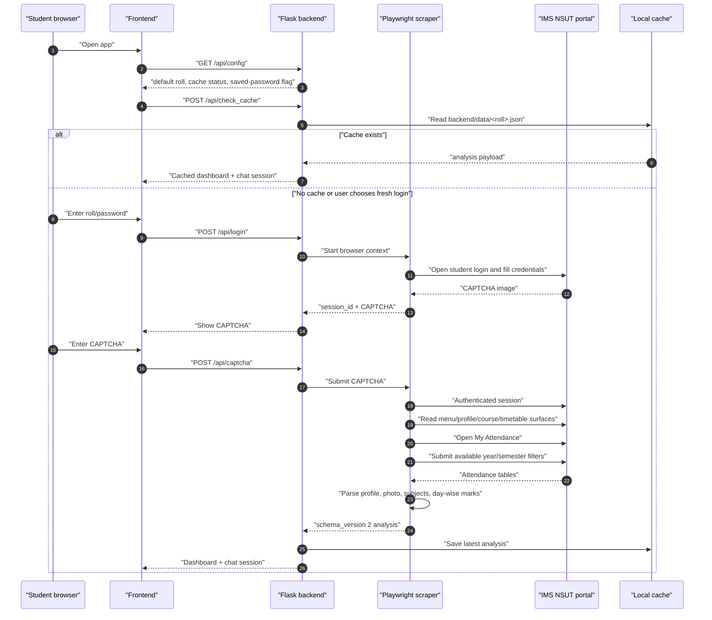
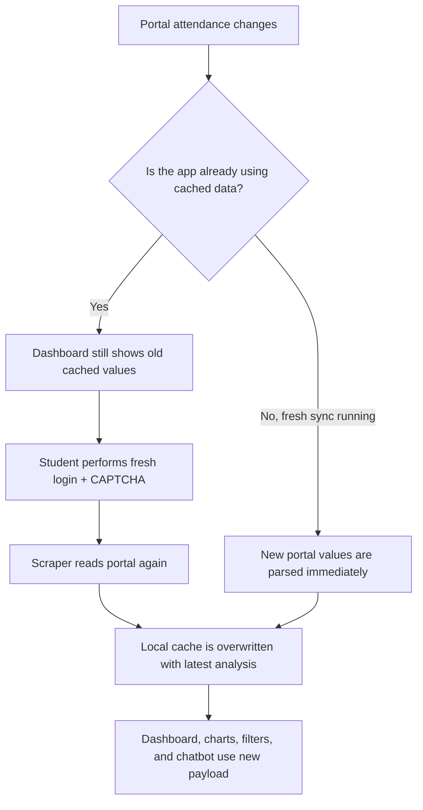
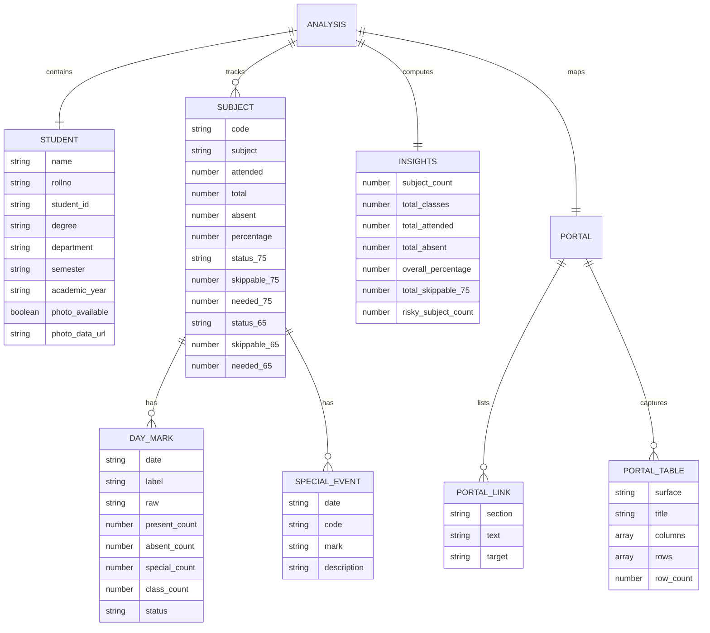
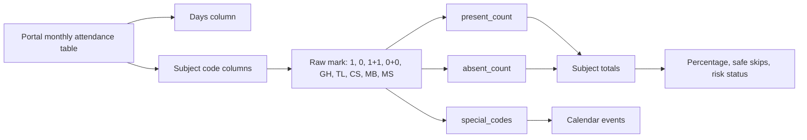
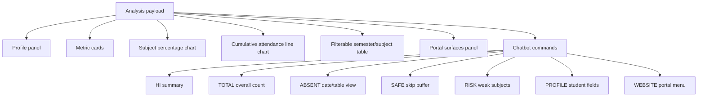

# Attendance Assistant Session Flow

This document explains what happens when a student logs in, what is cached, and when portal changes become visible in the assistant.

## Login And Sync Flow

## What Happens When Portal Data Changes

The assistant does not automatically poll the portal in the background. On app open, it loads the local cache first because that is fast and avoids asking CAPTCHA every time.

Important behavior:

- **Logout** in the UI only leaves the current assistant session and returns to the login screen.
- **Logout does not delete the local cache.**
- If portal data changes after the cache was created, the app needs a **fresh login + CAPTCHA** to refresh the cache.
- Fresh sync tries all available semester options by default, tags each subject with its semester, and then the dashboard semester filter reads those tags.
- Set `ATTENDANCE_SYNC_ALL_SEMESTERS=0` only if you want the old first-working-semester behavior for faster testing.
- If login succeeds but the portal returns an empty attendance report, the app now keeps the user inside the assistant and loads the last valid cache with a live-sync warning.
- CAPTCHA sessions expire quickly. If CAPTCHA is old, use refresh and submit the new image.

## Cached Payload Shape

## Portal Data Currently Used

| Portal area | What the assistant reads | Where it is used |
|:---|:---|:---|
| Login banner | Welcome name and student photo signal | Header, profile panel, chat `PROFILE` |
| Attendance form | Roll number, degree, department, academic year, semester | Profile panel, source metadata |
| Attendance tables | Subject codes, subject names, semester tags, monthly/day-wise marks, totals | Charts, tables, filters, chatbot |
| Attendance legend | GH, TL, CS, MB, MS, OD, NT and similar marks | Calendar/special event analysis |
| My Activities menu | Available portal sections and links | `WEBSITE`, portal surfaces panel |
| ID Card Details | Student/profile key-value fields when page loads | Profile panel and chat `PROFILE` |
| Current Sem Courses Registered | Course table when page loads | Captured portal tables |
| My Timetable | Timetable table when page loads | Captured portal tables |

## Attendance Table Columns

Meaning of common marks:

| Mark | Meaning |
|:---|:---|
| `1` | Present |
| `0` | Absent |
| `1+1` | Multiple present periods on the same day |
| `0+0` | Multiple absent periods on the same day |
| `GH` | Gazetted holiday |
| `TL` | Teacher leave |
| `CS` | Class suspended officially |
| `MB` | Mass bunk |
| `MS` | Mid-sem exam |
| `OD` | Teacher on official duty |
| `NT` | Class not taken |
| `NA` | Timetable not allotted |

## UI Behavior

The charts and filters are frontend-only views of the same analysis payload. They do not change portal data; they only help the student inspect it faster.
