# Kairon System Design & Workflow

## 🎯 Philosophy: Why CAPTCHA Matters (& Why We Can't Avoid It)

### The Trade-off: Security vs. Seamlessness

You want **"smoothless" (seamless)** attendance access. Here's why CAPTCHA is necessary:

```
┌─────────────────────────────────────────────────────────────────┐
│ Option A: Automated Login (No CAPTCHA)                          │
├─────────────────────────────────────────────────────────────────┤
│ ✓ Super fast (1 second)                                         │
│ ✓ Completely automated                                          │
│ ✗ NSUT would BLOCK our IP after 5-10 requests                   │
│ ✗ Rate-limiting triggers → app becomes unusable for everyone    │
│ ✗ Violates NSUT's Terms of Service                              │
│ ✗ Your account could get LOCKED                                 │
└─────────────────────────────────────────────────────────────────┘

┌─────────────────────────────────────────────────────────────────┐
│ Option B: CAPTCHA Required (Our Choice)                         │
├─────────────────────────────────────────────────────────────────┤
│ ✓ Only 1 CAPTCHA per session (5-min cache = repeat logins OK)   │
│ ✓ Proves it's a real user (avoids IP bans)                      │
│ ✓ NSUT allows it (respects their security)                      │
│ ✓ Account stays safe                                            │
│ ~ 5-10 second overhead (worth the security)                     │
└─────────────────────────────────────────────────────────────────┘
```

### How We Made It "As Seamless as Possible"

1. **User solves CAPTCHA ONCE per session** → data cached for 5 minutes
2. **Future logins check cache first** → skip CAPTCHA if data still fresh
3. **Frontend displays CAPTCHA inline** (not a popup) → integrated experience
4. **Auto-load from cache** if available → often instant access

### The Goal

```
First Login:    [Roll] [Pwd] [CAPTCHA] → 10 seconds → ✓ Access for 5 min
Second Login:   [Roll] [Pwd]           → 1 second   → ✓ From cache
(within 5 min)  (no CAPTCHA needed)
```

---

## 🔄 Complete Request Lifecycle: "Connect to Portal" Click

### Step 1: User Clicks "Connect to Portal"

```
Frontend receives: {rollno, password, semester}
                    ↓
          POST /api/login
                    ↓
         Backend Flask receives request
```

### Step 2-5: Backend Initiates Scraper

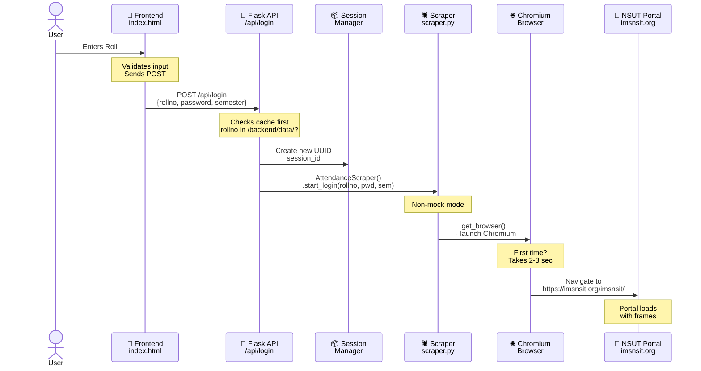

### Step 3: Scraper Fills Login Form & Captures CAPTCHA

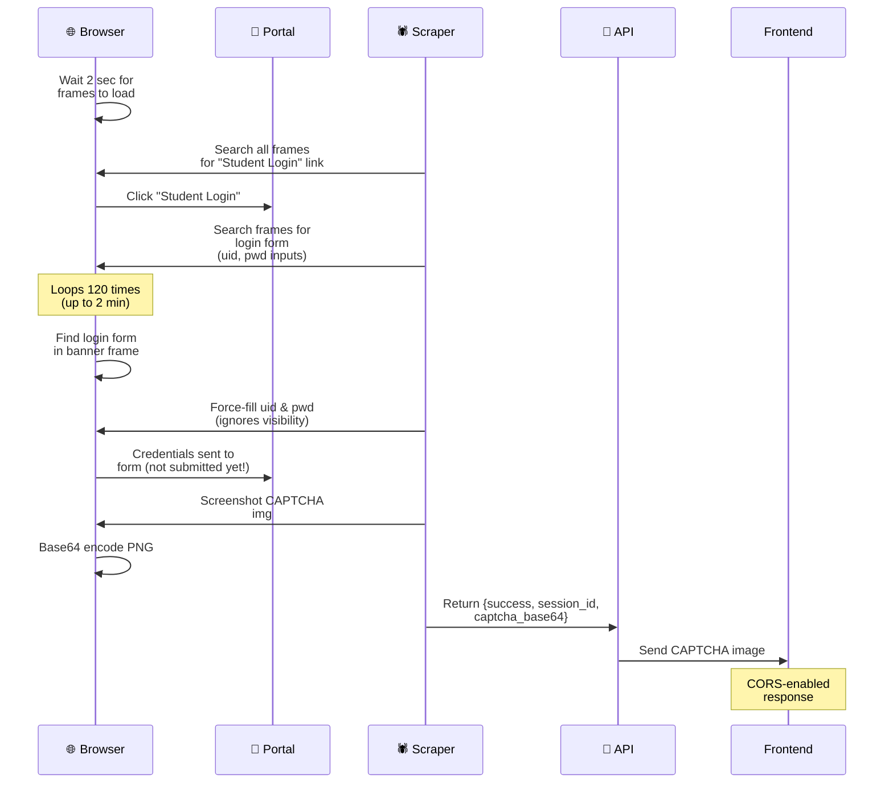

### Step 4: Frontend Displays CAPTCHA & Waits for User

```html
<!-- What user sees -->

<input type="text" id="captcha-input" placeholder="Enter CAPTCHA text">
<button onclick="submitCaptcha()">Submit</button>
```

### Step 5: User Solves & Submits CAPTCHA

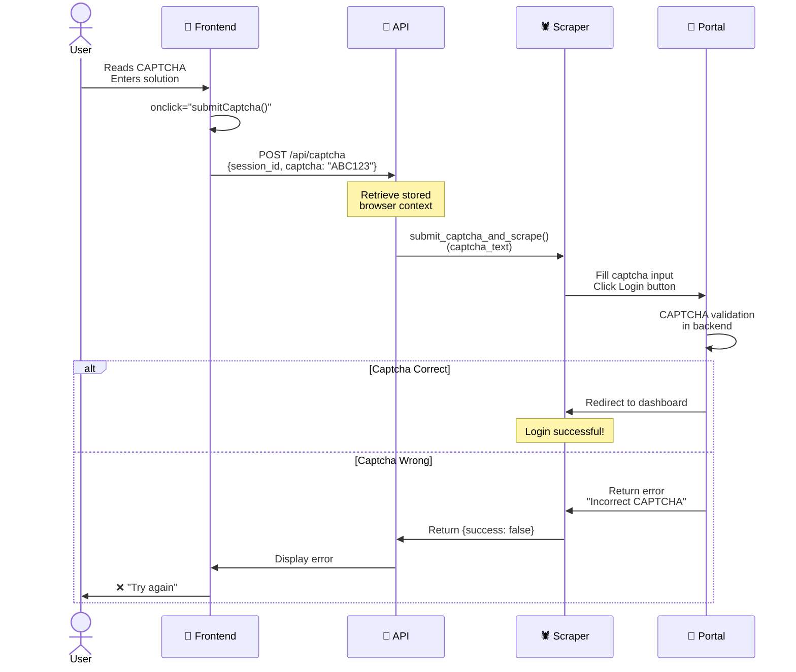

### Step 6: Deep Scrape - Navigate to "My Attendance"

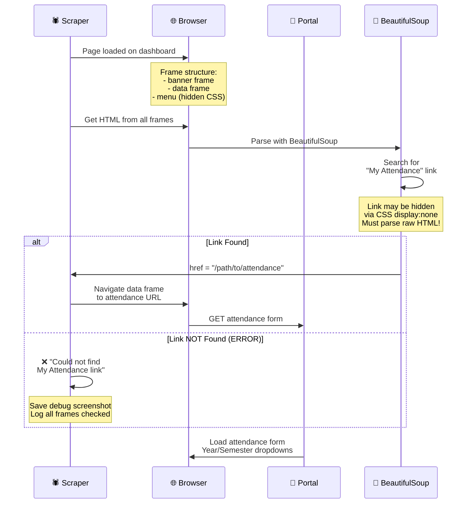

### Step 7: Select Year & Semester, Submit

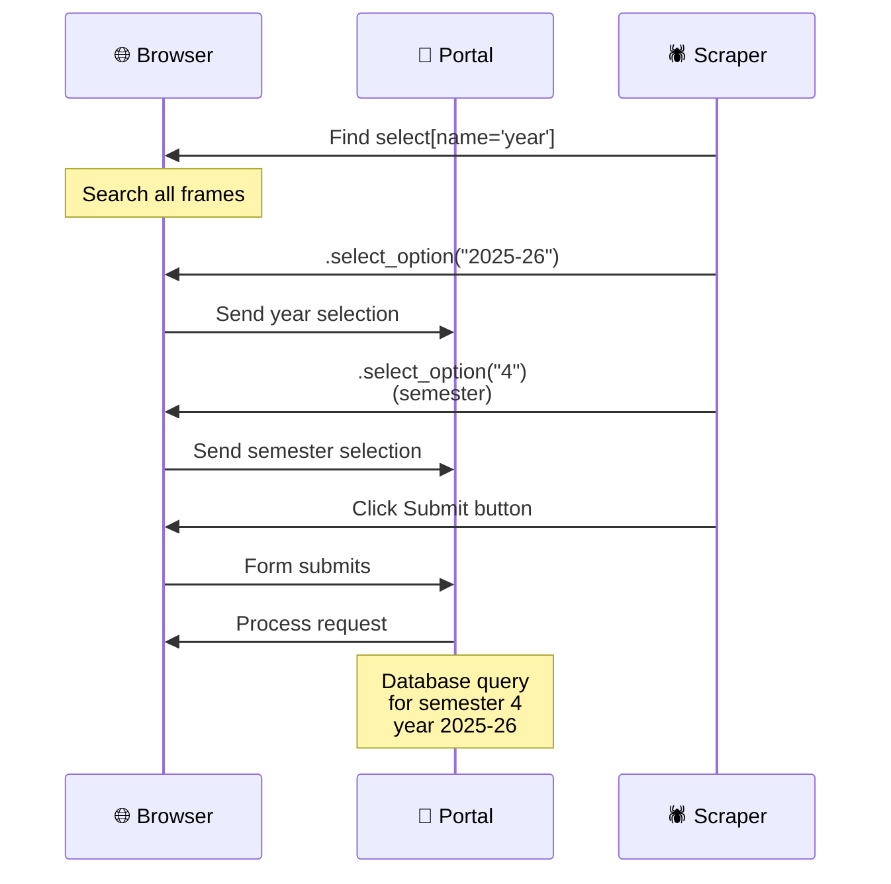

### Step 8: Parse Attendance Table

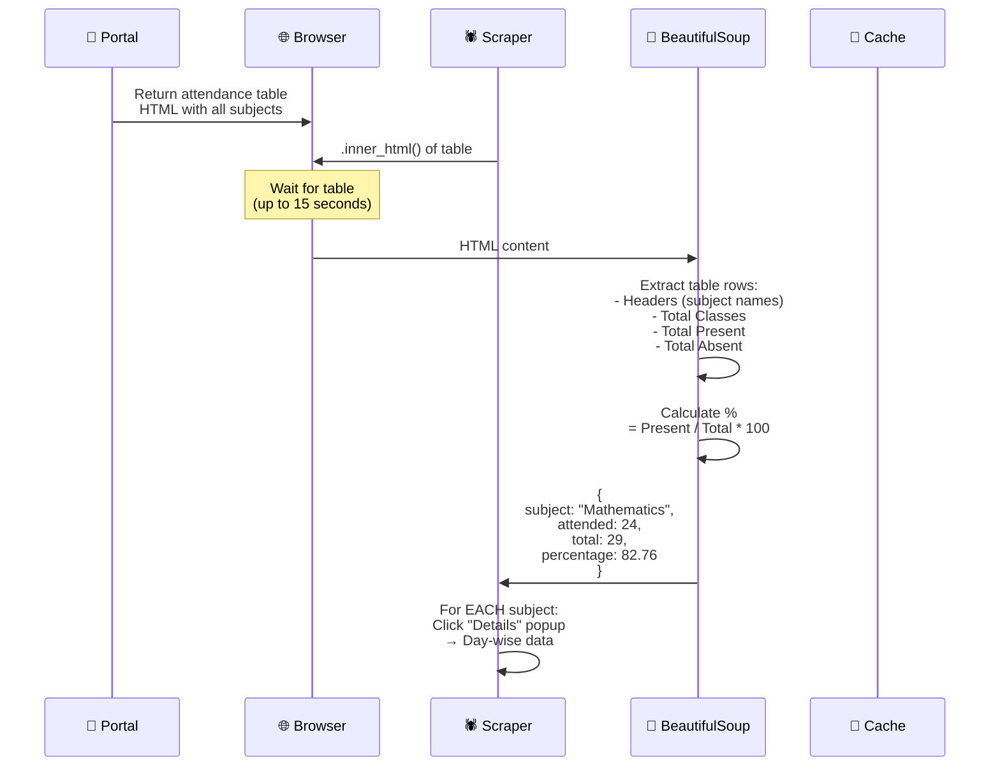

### Step 9: Deep Scrape - Day-Wise Attendance

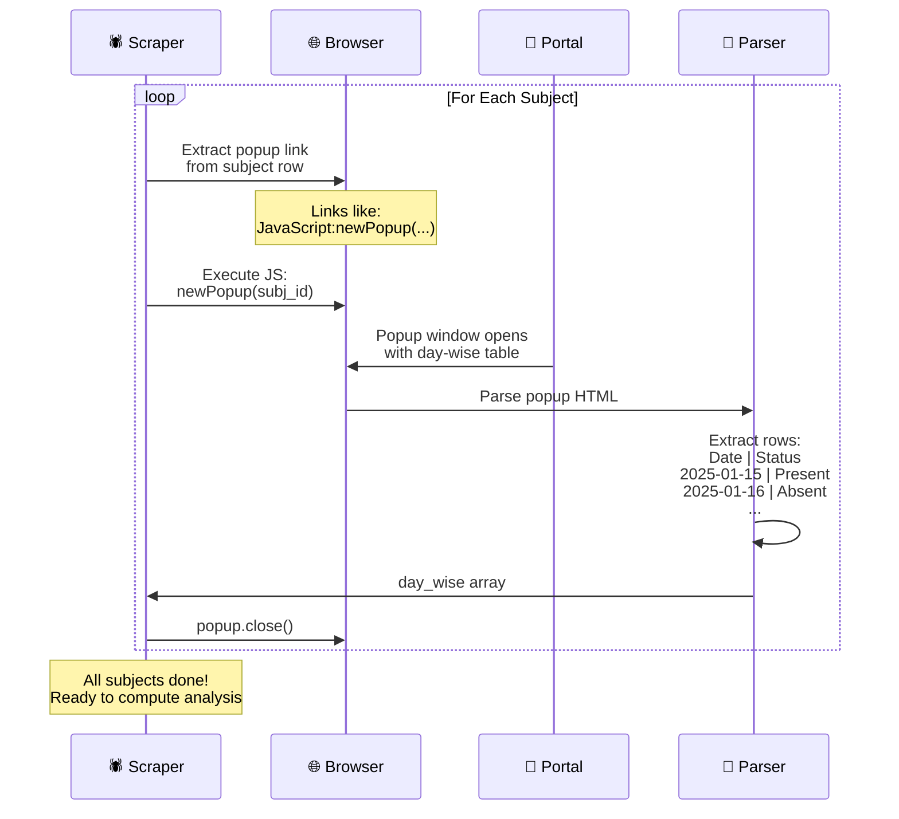

### Step 10: Compute Analysis & Cache

```mermaid
sequenceDiagram
    participant Scraper as 🕷️ Scraper
    participant Analyzer as 🧮 Analyzer
    participant Cache as 💾 Cache
    participant API as 🔌 API
    participant Frontend as 🎨 Frontend

    Scraper->>Analyzer: _compute_full_analysis()<br/>(attendance_data)

    Analyzer->>Analyzer: For EACH subject:<br/>- Attendance %<br/>- Leave prediction @75%<br/>- Leave prediction @65%<br/>- Day-wise breakdown

    Note over Analyzer: Threshold logic:<br/>If % >= 75%: SAFE<br/>  Can skip N classes<br/>If % < 75%: DANGER<br/>  Need to attend M more

    Analyzer->>Scraper: Full analysis JSON

    Scraper->>Cache: Save to<br/>backend/data/&lt;roll_no&gt;.json

    Scraper->>API: {success: true,<br/>message: "Data synced!"}

    API->>Frontend: ✓ Login complete!

    Frontend->>Frontend: Hide captcha<br/>Show chat interface

    Frontend->>API: POST /api/chat<br/>{session_id, message: "hi"}

    Note over Frontend: User can now ask:<br/>"hi" / "sw" / "danger" /<br/>"safe" / "subject_name"
```

---

## 💾 Data Structure: What Gets Saved

### Raw Attendance Object (Per Subject)

```json
{
  "subject": "Data Structures",
  "attended": 18,
  "total": 22,
  "percentage": 81.82,
  "day_wise": [
    {"date": "2025-01-15", "status": "Present"},
    {"date": "2025-01-16", "status": "Absent"},
    {"date": "2025-01-17", "status": "Present"}
  ],
  "status_75": "safe",
  "message_75": "You can skip 0 more class(es) before dropping below 75%.",
  "skippable_75": 0,
  "needed_75": 0,
  "status_65": "safe",
  "message_65": "You can skip 4 more class(es) before dropping below 65%.",
  "skippable_65": 4,
  "needed_65": 0,
  "status": "safe",
  "message": "You can skip 0 more class(es) before dropping below 75%."
}
```

### Cached File Location

```
backend/data/
├── <roll_no>.json
├── <another_roll_no>.json
└── <third_roll_no>.json
```

**Each file contains:** Array of subject objects with full analysis.

---

## 🤖 Chatbot Processing Pipeline

### When User Types "HI"

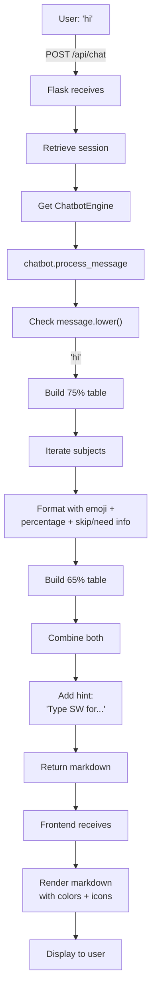

### When User Types "DANGER"

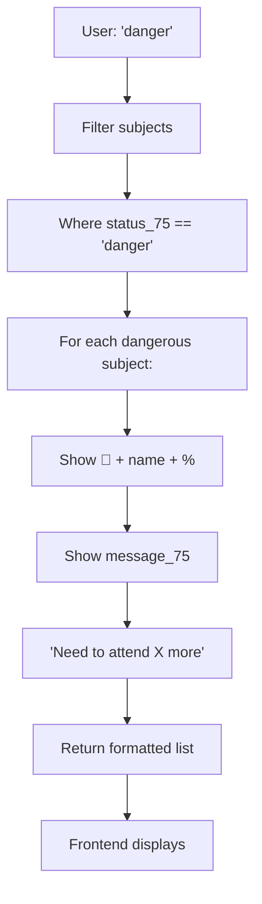

### When User Types "SW" (Subject-Wise)

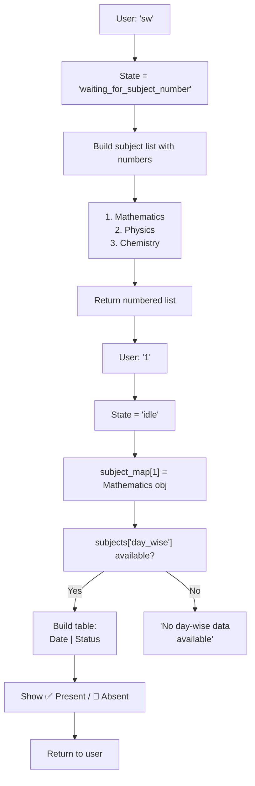

---

## ⚠️ Error Handling & Frame Detachment

### Why Frame Detachment Happens

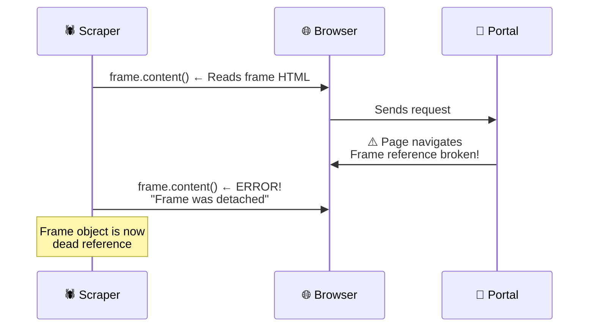

### Solution: Refresh Frame List

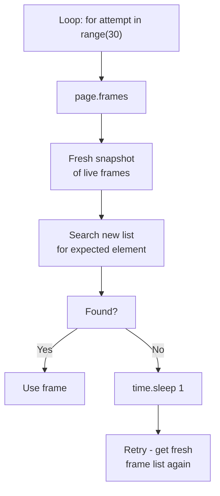

---

## 📊 Session Lifecycle & Memory

### Active Sessions Dictionary

```python
active_sessions = {
    "uuid-1": {
        "context": BrowserContext,      # Playwright context
        "page": Page,                   # Main page object
        "login_frame": Frame,           # Cached login frame
        "semester": "4",
        "timestamp": 1715000000.0       # When created
    },
    "uuid-2": { ... }
}
```

### Cleanup Logic (Every 5 Minutes)

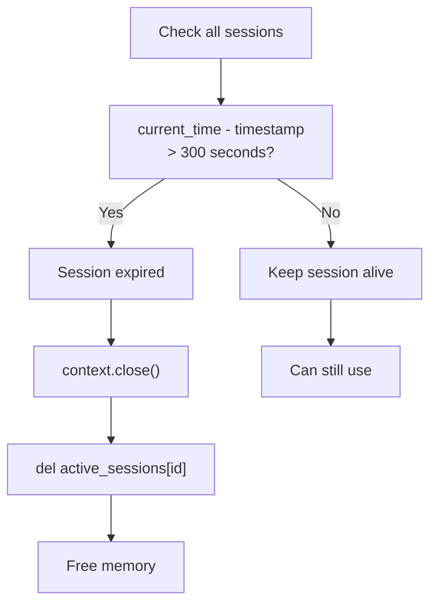

---

## 🔒 Security Measures

| Layer | Protection |
|:---|:---|
| **Credentials** | Stored in `.env` (NOT in code, NOT in git) |
| **Session IDs** | UUID v4 (cryptographically random) |
| **CAPTCHA** | Proves human user (prevents automated attacks) |
| **Cache** | 5-minute TTL (stale data auto-discarded) |
| **CORS** | Flask-CORS enabled (only same-origin requests) |
| **Frame Lifecycle** | Closed on error or timeout (prevents memory leaks) |
| **Logging** | Sensitive data NOT logged (no passwords/IPs in logs) |

---

## 🚀 Performance Metrics

| Operation | Time | Notes |
|:---|:---|:---|
| Launch browser | 2-3s | First time only |
| Navigate to portal | 1-2s | Network dependent |
| Fill credentials | 0.5s | Immediate |
| Capture CAPTCHA | 0.2s | Screenshot |
| User solves CAPTCHA | 10-30s | **User action** |
| Submit & validate | 2-3s | Portal backend |
| Parse attendance table | 1-2s | BeautifulSoup |
| Deep scrape (day-wise) | 5-10s | Multiple popups |
| **Total first login** | **25-55s** | Mostly waiting on user |
| **Cache hit (2nd login)** | **1-2s** | Instant! |

---

## 🎓 Learning Path: Understanding the Flow

1. **Start here:** README.md (setup & API overview)
2. **Understand architecture:** ARCHITECTURE.md (system design)
3. **Deep dive:** This file (workflow & data structures)
4. **Debug issues:** Check logs + compare frames
5. **Extend:** Add features to ChatbotEngine or Scraper

---

## 💡 FAQ: Frame Detachment & Portal Changes

**Q: Why does frame.content() sometimes fail?**  
A: Portal navigates to new page → old frame reference invalidates → "Frame was detached". **Solution:** Refresh frame list on every loop iteration.

**Q: Could the "My Attendance" link disappear?**  
A: Yes, if NSUT changes their portal HTML structure. **Solution:** Update the search logic in `scraper.py:_parse_attendance_html()` to look for new link patterns.

**Q: Can I use this without CAPTCHA?**  
A: Not reliably. NSUT rate-limits/blocks automated logins. **Workaround:** Use mock mode for testing (`use_mock=True`).

**Q: How long does cache persist?**  
A: 5 minutes per session. After that, user must re-login. **Rationale:** Attendance updates infrequently; 5 min is safe refresh window.

---

## 📚 Related Documentation

- **README.md** → Setup & endpoints
- **ARCHITECTURE.md** → System diagrams
- **backend/app.py** → Route handlers
- **backend/scraper.py** → Scraping logic
- **backend/chatbot.py** → Q&A logic
- **backend/logging_config.py** → Request logging

---

## 🎯 Next Steps for Enhancement

**To make it MORE seamless:**

1. **Auto-retry on frame detach** ✅ (Already implemented)
2. **Improve frame detection** ✅ (Better error messages)
3. **Add SMS CAPTCHA support** ❌ (Portal doesn't offer)
4. **Cache across days** ❌ (Data stale)
5. **Browser automation bypass** ❌ (Violates NSUT ToS)

**The CAPTCHA is NOT a limitation—it's a feature.** It's what keeps the app safe, legal, and sustainable.
